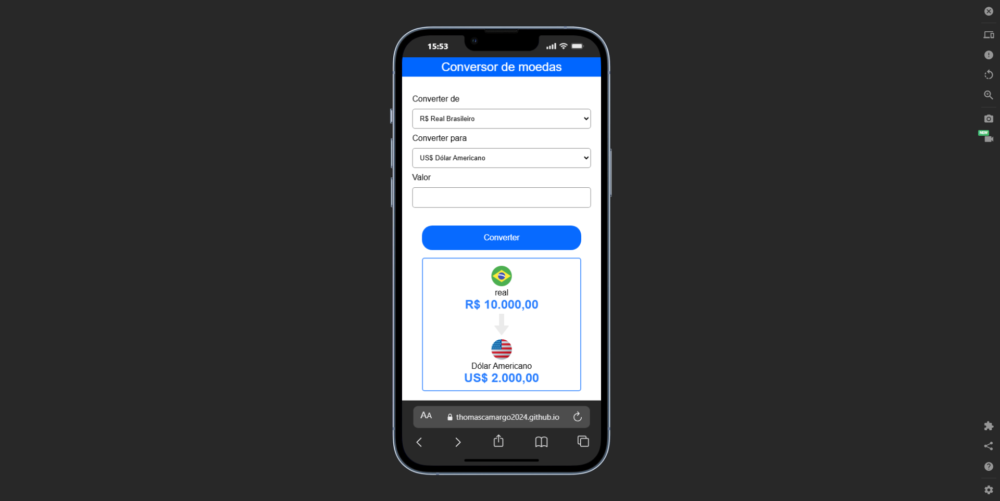

# 💱 Conversor de Moedas

## 📌 Sobre o projeto

Este projeto é um **conversor de moedas** desenvolvido com **HTML, CSS e JavaScript**, com foco em praticar manipulação do DOM, lógica de programação e consumo de valores dinâmicos.

A aplicação permite converter valores entre moedas de forma simples, rápida e intuitiva.

---

## ⚙️ Funcionalidades

- 💵 Conversão de valores em tempo real  
- 🔄 Interface simples e intuitiva  
- 📱 Layout responsivo  
- ⚡ Atualização dinâmica sem recarregar a página  

---

## 🚀 Tecnologias utilizadas

- HTML5  
- CSS3  
- JavaScript  

---

## 📷 Demonstração

---

## 🎯 Objetivo do projeto

Este projeto foi desenvolvido com o objetivo de praticar:

- Manipulação do DOM  
- Lógica de programação em JavaScript  
- Estruturação de páginas web  
- Estilização com CSS  

---

## 📁 Estrutura sugerida
